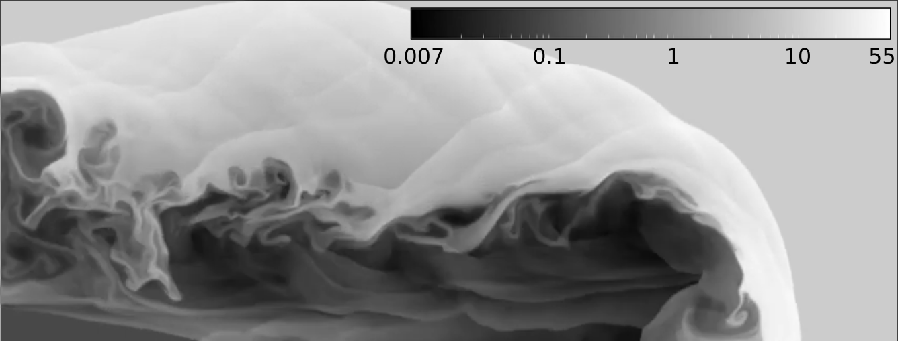

# Summary

Conservation equations from various branches of mathematical physics 
often take the form of hyperbolic partial differential equations (PDEs).
The finite-volume method (FVM), see @leveque2002finite, allows to obtain an approximate solution, by 
first discretizing these equations on a spatial grid, and then marching in time in order to 
follow the time evolution of the discretized fields.

Many different conservation equations can be written as a set of hyperbolic PDEs.
Some examples are the scalar Burgers equation, the shallow water equations,
the Euler equations for gas dynamics and countless other systems.

# Statement of need

`Hyper2D` is a minimalistic FVM solver for hyperbolic equations, written in Fortran 2003.
Its simple structure makes `Hyper2D` accessible, easy to learn and heavily customizable.
In particular, `Hyper2D` targets 

1. students and newcomers to the finite-volume method;

2. researchers wishing to implement their own set of PDEs.

With respect to existing tools for solving PDEs and fluid flows such as OpenFoam,
see @Jasak07openfoam, or SU2, see @palacios2013stanford, `Hyper2D` focuses on a 
simple yet general implementation.
Different PDEs are easily implemented, with little or no modification of the code.
The code is completely procedural, and object-oriented programming is avoided.

### An introductory code

The `Hyper2D` package contains a number of independent implementations of the FVM solver.
Each standalone implementation has an increasing level of complexity and offers further features.
Students can step in at the most appropriate level, depending on their knowledge of the method, 
and work their way towards the more thorough implementations.

The simplest version is one-dimensional, written in Octave/MATLAB, and allows the students
to familiarize with the FVM method.
Two-dimensional versions are then provided, for simple Cartesian grids, as well as unstructured
grids of quadrilateral elements.
In each version, additional complexities are introduced, such as internal solid surfaces and more 
advanced physics or numerics.
Finally, a CUDA Fortran version is provided, that allows one to exploit GPU acceleration.

Currently, `Hyper2D` is being used in the Fundamentals of Hypersonic Flows course at 
Politecnico di Milano.
Students typically use it for testing out the effect of the thermochemical model on the flow topology, 
for implementing new physical models and learning the numerics.

### A research code

The simple structure of `Hyper2D` makes it easily customizable.
One can easily implement a new set of PDEs, by modifying the simple examples provided.
The whole solution vector is available throughout most of the code:
this gives additional flexibility, as one has the freedom to implement non-local source 
terms for instance, or implement different numerical schemes.

`Hyper2D` was originally conceived as a research code, aimed at studying non-equilibrium flows
and plasmas.
Until now, `Hyper2D` has been employed in the following publications, for solving moment equations for rarefied
fluid dynamics, @boccelli2021thesis, and for simulating collisionless ions in plasma space propulsion devices, 
@boccelli2022maxention, and @boccelli2020collisionless.

# Governing equations and numerics

`Hyper2D` solves governing equations in the form

\begin{equation}\label{eq:PDE}
  \frac{\partial U}{\partial t}
+ \frac{\partial F_x}{\partial x}
+ \frac{\partial F_y}{\partial y}
=
  S \, ,
\end{equation}

where $U$ is the state, $F_x$ and $F_y$ are the fluxes in the $x$ and $y$ directions and $S$ are source terms. 
These quantities are scalars (in case of a scalar equations) or vectors (for a system of PDEs).
If the eigenvalues of the flux Jacobian are real, the equations are hyperbolic.
Parabolic equations could also be solved with `Hyper2D`, but only after implementing diffusion fluxes.

`Hyper2D` offers some different numerical schemes for discretizing and solving \autoref{eq:PDE}. 
Such schemes are independent on the specific PDEs to be solved, and should work out of the box even after 
new equations are implemented.
Currently, `Hyper2D` offers the following explicit time integrators: 1st order Forward Euler; 2nd order Midpoint Euler;
3rd order Runge-Kutta; 3rd order low-storage TVD Runge-Kutta.

The computation of convective fluxes currently supports the following options: 
1st order in space, no reconstruction;
2nd order van Leer's MUSCL with TVD slope limiting;
3rd order WENO;
5th order WENO.

# Example

As a practical example, \autoref{fig:jet} shows the simulation of a supersonic axisymmetric jet,
obtained solving the relativistic Euler equations on an NVidia Tesla K20X GPU.
The initial conditions are taken from the test case by @mignone2005hllc.

# Acknowledgements

The authors would like to thank Prof. Aldo Frezzotti (Politecnico di Milano) for 
the insightful discussions about the hypersonic non-equilibrium features implemented 
in Hyper2D.

# References
